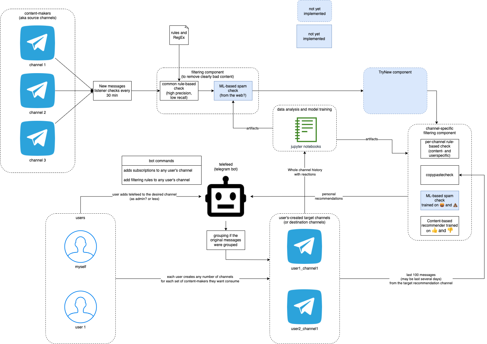

# Union Channel 
## What's it?

This is a simple program that will aggregate all your channels into one, as well as filter ads and duplicates in them. 
Deduplication works based on media, text, and text format. Duplicated media is enough to be rejected even with a new text.

## How it works?

The program through your account goes to all the channels that you have added to the `channels.json` and sends them to 
your personal (or not) channel. Subscribe to the channels in the telegrams is not required (based on the original 
realisation).

>In the new version, you can subscribe to a private channel. All private channels require a subscription therefore you will be automatically subscribed to this channel. It will be immediately archived

## How to use?

+ Firstly, install all requirements with 
    >pip install -r requirements.txt
+ Go to my.telegram.org and create your own app (get your api_id and api_hash).
+ Create a channel where you want to see the news.
+ Create a bot with t.me/BotFather.
+ Now paste all data into `config.py`, like this:

      ###     Telegram-client side:   ###
      api_id = XXXX
      api_hash = "XXXXXXXXXXXXXXXXXXX"
      MyChannel = "XXXXXXXXXXXXXXXXXXXXXXXX" # link to your chat 
 
      ###          Bot-side:          ###
      bot_token = "XXXXXXXXXXXXXXXXXXXXXXXXXXXXX"
      admin_chat_id = None       
      channel_id = None

 Data like `admin_chat_id` and `channel_id` you can get with debug value ("None") and replace. Optional:

        admin_chat_id = 12345       
        channel_id = -1234567

+ On first start you must enter phone-number and password from telegram-account. Telethon requried.
## Some bot commands

    /add - Add channel
    /del - Delete channel
    /channels - Channels List
    /addrule - Add rule
    /delrule - Delete rule
    /setads - Enable/Disable AdBlock
    /rules - List of AdBlock rules

# TODO
1. Calculate statistics for originality of content produced
   1. find real origins of forwarded forwarded...
   2. add counters to them 
2. Deduplication of subscriptions
3. Add liked memes from profunctor
4. Add reactions + spam report to be automatically used as a per-person feedback loop
   1. Add recommender system
5. Keep this bot hosted on a server
   1. database will contain user's preferences, subscription lists
   2. bot which everyone can configure for personal needs and personal feed
   3. recsys trained on all users
      1. Post reactions as features for recommender
6. Add more complex spam detector
   1. count vectorizer to start with?
   2. Average URL Number per Message
   3. Unique URL Number
   4. domain
   5. add feedback loop from my reactions in the chat (and then delete the posts)
7. Add dict with channel names from ids?
8. Update filtering rules to a list (mb dict with some level of severity)
9. Check forwarding from channels without subscription
10. deduplicate if the post covers the same news or the same model (within some period of time). 
Different opinions from different channels might be interesting but very similar content 
about the same news is definitely not
    1. text similarity?
    2. same references used (links, channels, named entities)
       1. if channel B refers to channel A in their post, the channel's B note may be added to the
       channel's A repost at the end as an opinion
    3. time of the post is more or less similar (within 24 hour or sth)
    4. What to do with that?
       1. First served policy
       2. Somehow aggregate opinions from different channels via updating the first post on this topic
       3. Take better?
11. Channel recommendation [Vlad](https://github.com/sawyre)'s idea). PageRank?
12. RL for recommender?
13. fix Russian spam-filter bypass #промо 
14. If server is not available, close the session
15. Add static code analysis
16. One user can make several bots with different topics and each will be covered with personal recommendations and great 
spam-checker
17. If you are going to read several messages and the last one is a part of a group, the group has to be finished
18. In debug mode, show what kind of post was forwarded (what media inside)
19. Do not subscribe to what you read
20. make buttons from common commands
21. resolve dst_ch reading another dst_ch. infinite forwarding btw dst channels
22. trace channel name changes
23. clean `https://t.me/profunctor_io`
24. add deletion from channel
25. create a func for deleting messages via bot
26. send some filtered digest to user like "5 msg from this channel were filtered due to this and this filter. you can
still find this content via this link"

# Developing notes
1. It was a news for me that programming a telegram bot is not the only thing you can program for Telegram. Telegram
offers [two kinds of APIs for developers](https://core.telegram.org/api): "the Bot API allows you to easily create 
programs that use Telegram messages for an interface. The Telegram API and TDLib allow you to build your own customized 
Telegram clients.". In other words, you can interact in almost any possible way with Telegram via API and develop any 
kind of application based on this API. Bots are just a popular use-case covered with various handy libraries.
2. [This page lists some libraries and frameworks developed by the Telegram community](https://core.telegram.org/bots/samples). 
Personally, I feel myself comfortable with [Python ones](https://core.telegram.org/bots/samples#python). I have briefly
estimated most of these libraries\frameworks and here are my thoughts:
   1. [python-telegram-bot](https://github.com/python-telegram-bot/python-telegram-bot) - the most popular and the most
frequently updated. The interface doesn't look friendly
   2. [pyTelegramBotAPI](https://github.com/eternnoir/pyTelegramBotAPI) - the second most-popular library. The repo is 
also alive. The API looks similar to [python-telegram-bot](https://github.com/python-telegram-bot/python-telegram-bot) 
but in my opinion is friendlier. I started with it but realised that the bot API is limited and you have to use your own
account for check channel history, for example.
   3. [Telethon](https://github.com/LonamiWebs/Telethon) - too difficult for me. I found a snipped and used in another 
[project of mine](https://github.com/OlegBEZb/telebot/blob/main/interactive_telegram_client.py). At first, I didn't want 
to use it because I completely don't know asyncio. But because of the reason mentioned in the previous point (plus due 
to [this concept](https://github.com/LonamiWebs/Telethon/blob/v1/readthedocs/concepts/botapi-vs-mtproto.rst)), 
I chose Telethon finally.
   4. [telepot](https://github.com/nickoala/telepot) - great but abandoned. I tried it but the library is very outdated 
with respect to the API used and requires manual patches.
([example](https://stackoverflow.com/questions/66796130/python-bot-telepot-error-raise-keyerrorno-suggested-keys-s-in-s-strkey)).